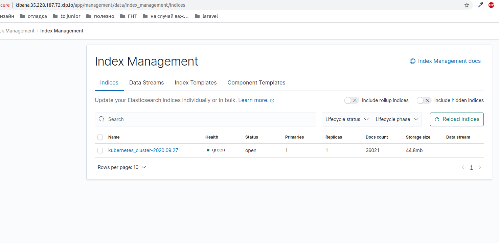
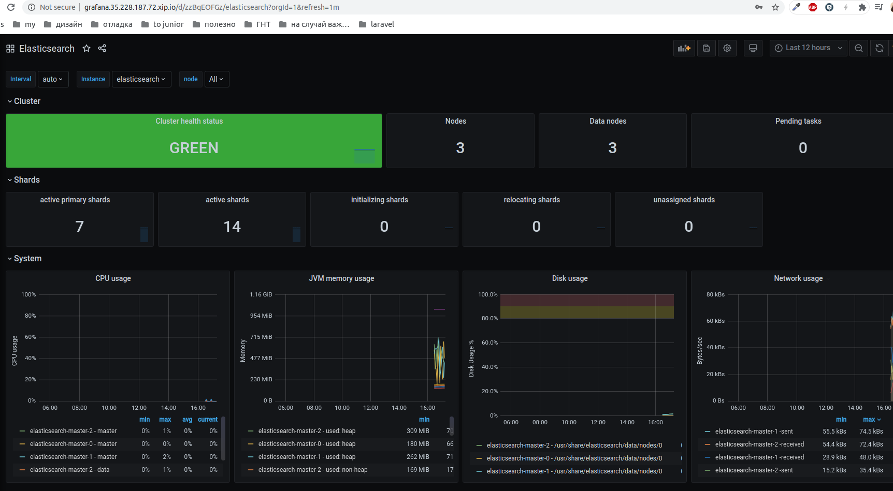
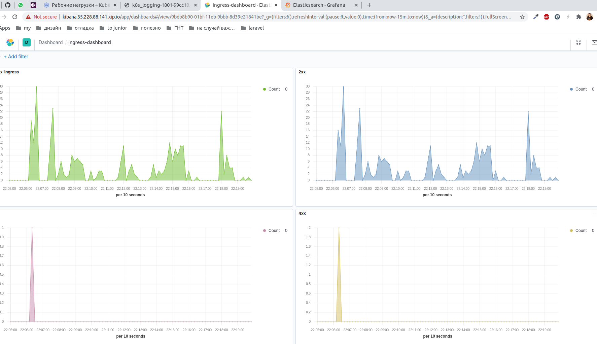
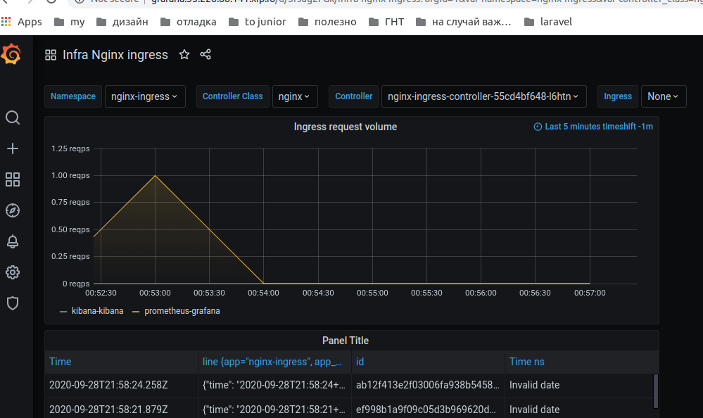

## Создан кластер GCP

## Переклоючаем контекст на gcloud
```
gcloud init
gcloud container clusters get-credentials cluster-1
```
## Установка EFK
```
kubectl create ns microservices-demo
kubectl apply -f https://raw.githubusercontent.com/express42/otus-platform-snippets/master/Module-02/Logging/microservices-demo-without-resources.yaml -n microservices-demo
helm repo add elastic https://helm.elastic.co
kubectl create ns observability
helm upgrade --install elasticsearch elastic/elasticsearch --namespace observability
helm upgrade --install kibana elastic/kibana --namespace observability
helm repo add stable https://kubernetes-charts.storage.googleapis.com
helm upgrade --install fluent-bit stable/fluent-bit --namespace observability
```
уточним что ставимся только на infra ноды
```
helm upgrade --install elasticsearch elastic/elasticsearch --namespace observability -f kubernetes-logging/elasticsearch.values.yaml
```

## Установка nginx-ingress

по совету из слака в nginx-ingress.values.yaml были добавлен формат логов в json
```
kubectl create ns nginx-ingress
helm upgrade --install nginx-ingress stable/nginx-ingress --namespace=nginx-ingress --version=1.41.3 -f kubernetes-logging/nginx-ingress.values.yaml
```

##  Kibana

Добавляем хост (ip  - external ip service/nginx-ingress-controller):
```
kubectl get services -n nginx-ingress
helm upgrade --install kibana elastic/kibana --namespace observability -f kubernetes-logging/kibana.values.yaml
```
удаляем лишние ключ времени (time, @timestamp оставил):
```
helm upgrade --install fluent-bit stable/fluent-bit --namespace observability -f kubernetes-logging/fluentbit.values.yaml
```

## Prometheus exporter 
Установил prometheus-operator

```
helm repo add choerodon https://openchart.choerodon.com.cn/choerodon/c7n

helm upgrade --install prometheus  choerodon/kube-prometheus --version 9.3.1 \
 -n observability \
 --set prometheus.prometheusSpec.serviceMonitorSelectorNilUsesHelmValues=false -f kubernetes-logging/prometeus-operator.values.yaml

helm upgrade --install elasticsearch-exporter stable/elasticsearch-exporter --set es.uri=http://elasticsearch-master:9200 --set serviceMonitor.enabled=true --namespace=observability -f kubernetes-logging/elasticsearch-exporter.values.yaml
```
admin
prom-operator



## Мониторинг ElasticSearch

 - Импортровал через id dashboard ElasticSearch (4358)
 - Поигрался вс нодами (удалил, восстановил)

 

## EFK | nginx ingress

Добавил в конфиги fluent-bit, kibana, prometeus для порядочка и чтобы логи nginx-ingress тоже собрать
```
tolerations:
  - key: node-role
    operator: Equal
    value: infra
    effect: NoSchedule
nodeSelector:
  cloud.google.com/gke-nodepool: infra-pool
```
 
 ## Визуализация

сделал графики, объединил в дашборд, экспортировал в файл.

 


 ## loki

 ```
helm repo add loki https://grafana.github.io/loki/charts
helm upgrade --install loki loki/loki --namespace observability
 ```

 нашел в доке как пихнуть loki  в конфигурацию (https://grafana.com/docs/grafana/latest/features/datasources/loki/)

 ```
datasources:
  - name: Loki
    type: loki
    access: proxy
    url: http://localhost:3100
    jsonData:
      maxLines: 1000
 ```
применил его в конфиг чарта прометея:
```
  additionalDataSources:
    - name: Loki
      type: loki
      access: proxy
      url: http://loki:3100
      jsonData:
        maxLines: 1000
```
 попробовал обновить релиз  - дата-сорс не появился. Удалил, нактил по-новой - появился.
 появился, но задеплоил я loki  не на инфра-пул. Передеплоил с указанием куда деплоиться (переиспользовал файл elasticsearch-exporter.values.yaml)

```
helm upgrade --install promtail loki/promtail --set "loki.serviceName=loki" --namespace observability -f kubernetes-logging/elasticsearch-exporter.values.yaml
helm upgrade --install loki loki/loki --namespace observability -f kubernetes-logging/elasticsearch-exporter.values.yaml
```

добавил в конфиг nginx-ingress serviceMonitor, передеплоил

```
  metrics:
    enabled: true
    serviceMonitor:
      enabled: true
      namespace: "nginx-ingress"
      namespaceSelector: {}
      scrapeInterval: 30s
```

построил графики, поковырялся в настройках отображения 
 


