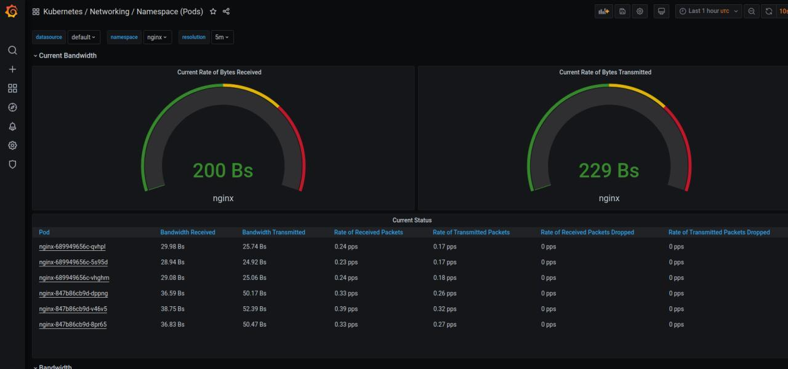

## что делалось

 - сделал deployment и service для Nginx, nginx-prometheus-exporter  apply
 ```
k apply -f nginx-deployment.yaml
```

 - поставил prometheus-operator по https://hub.helm.sh/charts/choerodon/kube-prometheus
 
```
k create ns monitoring
helm repo add choerodon https://openchart.choerodon.com.cn/choerodon/c7n
 helm upgrade --install prometheus  choerodon/kube-prometheus --version 9.3.1 \
 -n monitoring \
 --set prometheus.prometheusSpec.serviceMonitorSelectorNilUsesHelmValues=false
```

## Если пробросить порты, то можно посмотреть всякое

